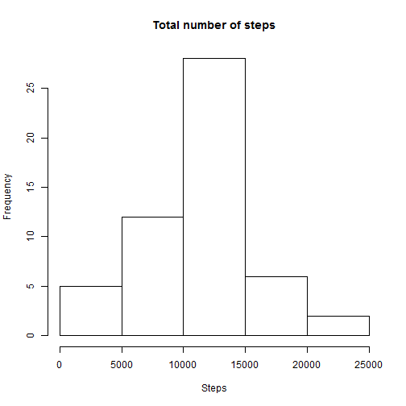
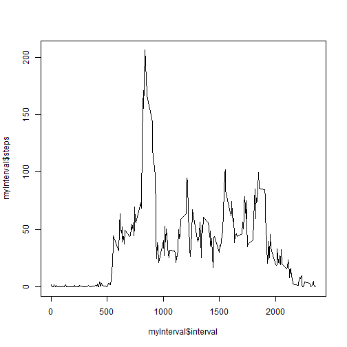
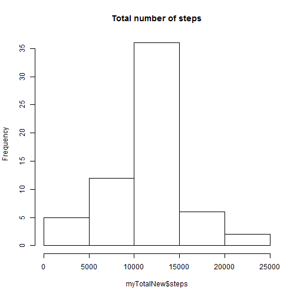
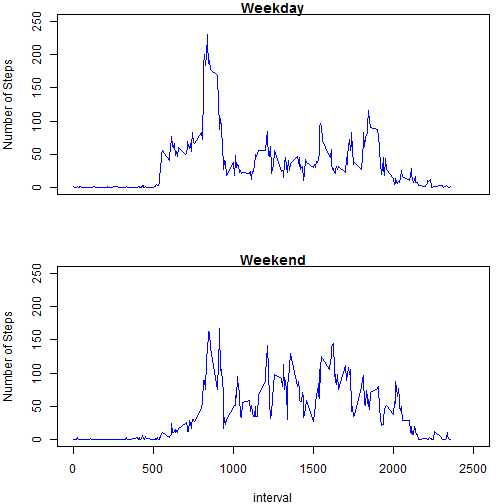

## Loading in and preprocessing data

Extract data from .zip file and read it:


```r
unzip("repdata-data-activity.zip")
activity <- read.csv("activity.csv", header = TRUE, nrows = 17570, colClasses = c("numeric", "Date", "numeric"))
```

## What is mean total number of steps taken per day?

Reshape the dataset to get the total numbers of steps per day:


```r
library(reshape2)
myMelt <- melt(activity, id = "date")
myTotal <- dcast(myMelt, date ~ variable, sum)
```

Create the histeogram of total numbers of steps taken each day:


```r
hist(myTotal$steps, main = "Total number of steps", xlab = "Steps")
```

 

Compute the the mean and median of total numbers of steps taken each day, NAs must be removed as otherwise the mean and median are NA:


```r
mean(myTotal$steps, na.rm = TRUE)
```

```
## [1] 10766.19
```


```r
median(myTotal$steps, na.rm = TRUE)
```

```
## [1] 10765
```

## What is the average daily activity pattern?

Reshape the data to get the mean for each interval:


```r
myMelt <- melt(activity, id = "interval", na.rm = TRUE)
```

```
## Warning: attributes are not identical across measure variables; they will
## be dropped
```

```r
myInterval <- dcast(myMelt, interval ~ variable, mean)
```

Create a time series plot of the means for each interval:


```r
plot(myInterval$interval, myInterval$steps, type = "l")
```

 


Calculate the interval with the maximum average of steps:


```r
myInterval[myInterval$steps == max(myInterval$steps), 1]
```

```
## [1] 835
```
## Imputing missing values

Computing the number of missing cases:


```r
nrow(activity[!complete.cases(activity), ])
```

```
## [1] 2304
```

Creating a new dataset in which the missing values for steps are replaced with the mean of the respective interval:


```r
x <- rep(myInterval$steps, 61)
activityNew <- activity
activityNew$steps[is.na(activityNew$steps)] <- x[is.na(activityNew$steps)]
```

Reshape the new dataset to get the total numbers of steps per day:


```r
myMeltNew <- melt(activityNew, id = "date")
myTotalNew <- dcast(myMeltNew, date ~ variable, sum)
```

Creating the histeogram for the new dataset:


```r
hist(myTotalNew$steps, main = "Total number of steps")
```

 

Calculating mean and median for the new dataset:


```r
mean(myTotalNew$steps)
```

```
## [1] 10766.19
```


```r
median(myTotalNew$steps)
```

```
## [1] 10766.19
```

As we can see the median above differs slightly from the median (10765) of the dataset without replacing the NAs.The imputing values contributes to a more symmetric (normal) distribution, where mean is equal median.

## Are there differences in activity patterns between weekdays and weekends?

Creating an new factor variable called 'Days' with the levels weekday and weekend

```r
Sys.setlocale(category = "LC_ALL", locale = "English_United States.1252")
```

```
## [1] "LC_COLLATE=English_United States.1252;LC_CTYPE=English_United States.1252;LC_MONETARY=English_United States.1252;LC_NUMERIC=C;LC_TIME=English_United States.1252"
```

```r
x <- as.factor(weekdays(activityNew$date))
levels(x) <- list(Weekday = "Friday", Weekday = "Monday", Weekend = "Saturday",
    Weekend = "Sunday", Weekday = "Thursday", Weekday = "Tuesday", Weekday = "Wednesday")
activityNew$Days <- x
```

Preparing the dataset to create a time series plot of the means for each interval for both weekend and weekday by subsetting and reshaping:


```r
myDaySub <- activityNew[activityNew$Days == "Weekday", c("interval", "steps")]
myEndSub <- activityNew[activityNew$Days == "Weekend", c("interval", "steps")]

myMeltDay <- melt(myDaySub, id = "interval", na.rm = TRUE)
myIntervalDay <- dcast(myMeltDay, interval ~ variable, mean)

myMeltEnd <- melt(myEndSub, id = "interval", na.rm = TRUE)
myIntervalEnd <- dcast(myMeltEnd, interval ~ variable, mean)
```

Creating a time series plot of the means for each interval for both weekend and weekday:


```r
par(mfrow = c(2, 1), mar = c(4, 4, 1, 1))
plot(myIntervalDay$interval, myIntervalDay$steps, type = "l", col = "blue",
    main = "Weekday", ylab = "Number of Steps", xlab = "", xaxt = "n", ylim = c(0,
        250),  xlim = c(0, 2500))

plot(myIntervalEnd$interval, myIntervalEnd$steps, type = "l", col = "blue",
    main = "Weekend", ylab = "Number of Steps", xlab = "interval", ylim = c(0,
        250), xlim = c(0, 2500))
```

 

